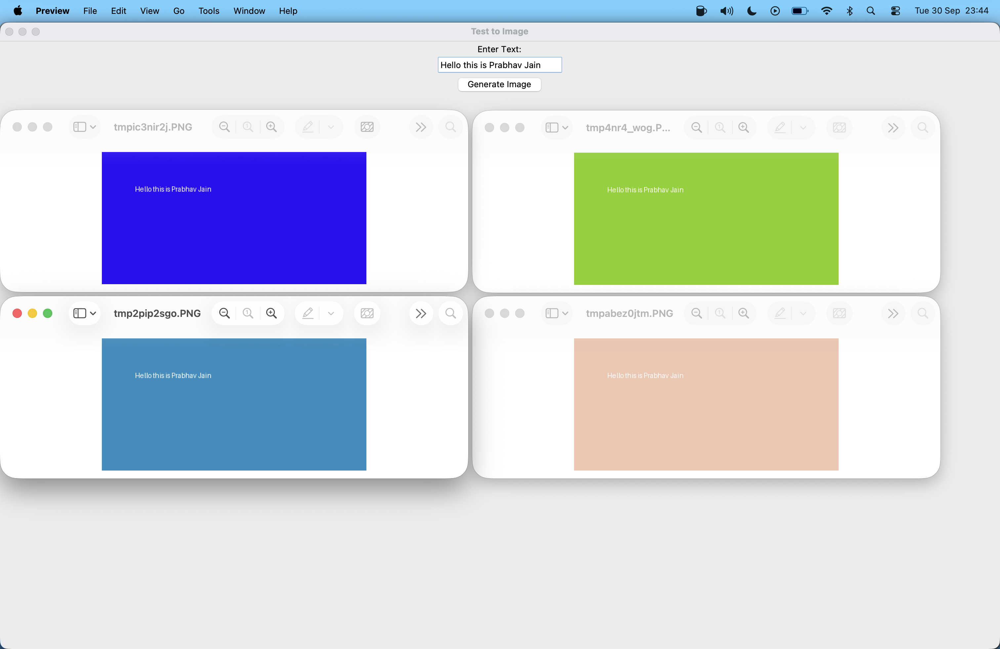

# Text to Image Generator (Tkinter Learning Project)  

This project is my **starting learning project for Tkinter**.  
I created a simple **Text-to-Image Generator** to understand how Tkinter works and how to combine it with Python libraries like Pillow (PIL).  

Instead of generating images *from text content creatively* (like AI), this app **creates images of the text itself**.  
It can be useful to:
- Convert long texts or text files into images for easy sharing.  
- Preserve formatting and move text across platforms.  
- Generate colorful, visually distinct images of text quickly.  

---

## Key Features
- Enter any text and generate an image with **random RGB background**.  
- Displays the entered text in white on the image.  
- Can be extended to handle **long text files**.  
- GUI built entirely with Tkinter — simple and interactive.  

---

## Full Features Learned and Implemented
- Created a **Tkinter window** with labels, entry fields, and buttons.  
- Learned to **bind button actions** to functions in Python.  
- Integrated **Pillow (PIL)** to create and draw text on images.  
- Generated **random backgrounds** for dynamic visuals.  
- Displayed generated images directly using Python’s default image viewer.  
- Learned how to **update the UI dynamically** and interact with user input.  

---

## What I Learned
Through this project, I gained hands-on experience with:  
- The **basic structure of a Tkinter app** (window creation, widgets, layout).  
- Handling **user input and events** with Tkinter.  
- Combining Tkinter with external libraries like Pillow.  
- Practical GUI design for interactive applications.  
- Using Python to **automate text-to-image conversion**, which can be extended for file-based or bulk text conversion.  

---

## How It Works
1. The user types text into the entry field.  
2. Click **"Generate Image"**.  
3. The program:  
   - Creates a random RGB background using Pillow.  
   - Draws the user’s text on top of the background.  
   - Opens the image in the default image viewer.
---

---
