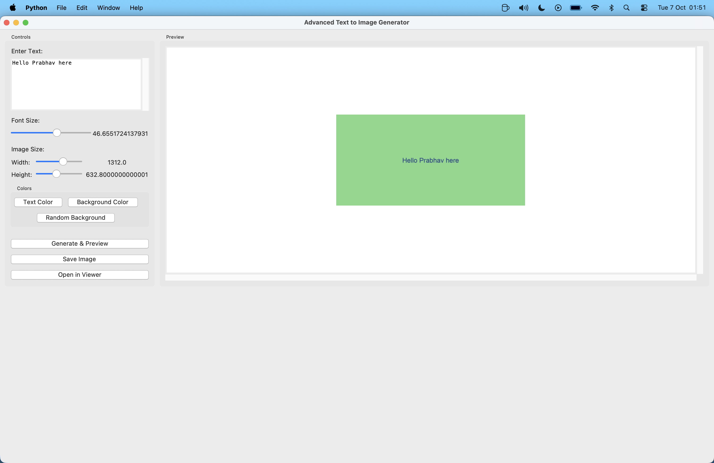

# Advanced Text to Image Generator

A powerful and user-friendly **Text-to-Image Generator** built with Python and Tkinter. This application creates beautiful images from text with extensive customization options, real-time preview, and professional features.

Instead of generating images *from text content creatively* (like AI), this app **creates images of the text itself** with advanced formatting and styling options.

## Key Features

### **Advanced Customization**
- **Custom Colors**: Choose any text and background colors using color picker
- **Font Size Control**: Adjustable font size from 12px to 72px with real-time slider
- **Image Dimensions**: Customizable width (400-1920px) and height (300-1080px)
- **Random Backgrounds**: Generate random colorful backgrounds with one click

### **Text Handling**
- **Multi-line Support**: ScrolledText widget for long text input
- **Smart Text Wrapping**: Automatic text wrapping to fit image dimensions
- **Paragraph Support**: Preserves paragraph breaks and formatting
- **Real-time Preview**: See changes instantly as you type

### **Image Management**
- **Live Preview**: Real-time preview with scrollable canvas
- **Save Functionality**: Save images in PNG or JPEG format with timestamp
- **External Viewer**: Open generated images in system default viewer
- **High Quality**: Support for high-resolution image generation

### **User Experience**
- **Modern UI**: Clean, professional interface with organized controls
- **Responsive Layout**: Resizable window with proper grid management
- **Error Handling**: User-friendly error messages and warnings
- **Intuitive Controls**: Grouped controls with clear labels

---

## Installation & Setup

1. **Clone the repository**:
   ```bash
   git clone <repository-url>
   cd text-to-image
   ```

2. **Install dependencies**:
   ```bash
   pip install -r requirements.txt
   ```

3. **Run the application**:
   ```bash
   python main.py
   ```

---

## Requirements

- Python 3.7+
- Pillow (PIL) 10.0.0+
- tkinter (usually included with Python)

---

## How to Use

1. **Enter Text**: Type or paste your text in the scrollable text area
2. **Customize Appearance**:
   - Adjust font size using the slider
   - Set image dimensions with width/height controls
   - Choose text and background colors
   - Or use random background colors
3. **Preview**: Watch real-time preview as you make changes
4. **Generate & Save**: 
   - Click "Generate & Preview" to update
   - Use "Save Image" to save with custom filename
   - Use "Open in Viewer" to view in external application

---

## Technical Features

### **Architecture**
- Object-oriented design with clean class structure
- Separation of UI and image generation logic
- Modular functions for easy maintenance

### **Image Processing**
- PIL/Pillow for high-quality image generation
- Smart text positioning and centering
- Efficient text wrapping algorithm
- Support for various image formats

### **UI Components**
- ttk themed widgets for modern appearance
- ScrolledText for multi-line input
- Scale widgets for numeric controls
- Canvas with scrollbars for preview
- Color chooser dialogs
- File dialogs for saving

---

## Screenshots



---

## Future Enhancements

- Font family selection
- Text alignment options (left, center, right)
- Background image support
- Gradient backgrounds
- Text effects (shadow, outline)
- Batch processing
- Template system
- Export to multiple formats

---
## License

This project is open source and available under the [MIT License](LICENSE).

---
